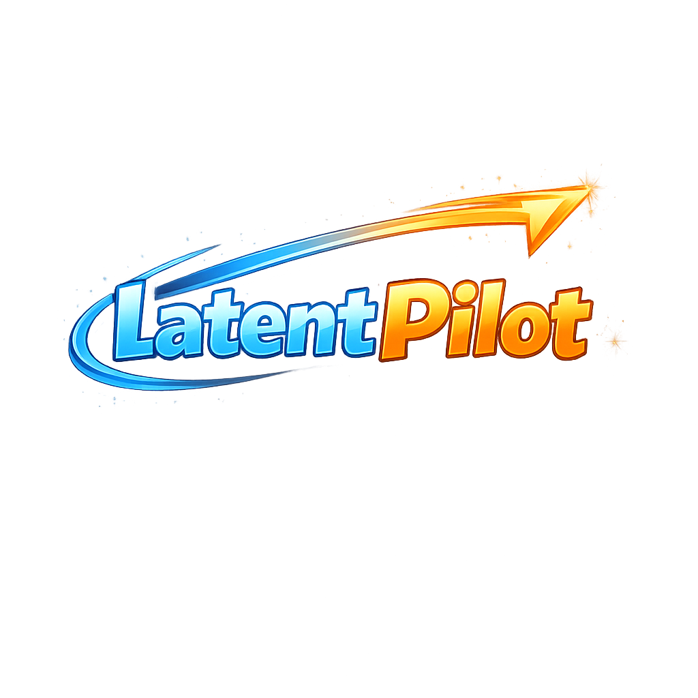

<a href="https://abdd.top/latentpilot/" target="_blank">
  
</a>

<div align="center">

# [<span style="background: linear-gradient(90deg, #7aa2ff 0%, #76e4ff 45%, #c3b7ff 100%); -webkit-background-clip: text; color: transparent; font-style: italic;">LatentPilot</span>](https://abdd.top/latentpilot/)

### Scene-Aware Vision-and-Language Navigation by Dreaming Ahead with Latent Visual Reasoning

<p>
  <a href="https://abdd.top" target="_blank">Haihong Hao<sup>🍕</sup></a> ·
  Lei Chen<sup>🍕</sup> ·
  <a href="https://mingfei.info" target="_blank">Mingfei Han<sup>🌭</sup></a> ·
  <a href="https://scholar.google.com/citations?hl=en&user=RLAgwBkAAAAJ" target="_blank">Changlin Li<sup>🍔</sup></a> ·
  <a href="https://marsaki.github.io/" target="_blank">Dong An<sup>⭐</sup></a> ·
  <a href="https://yuqiang-yang.github.io/" target="_blank">Yuqiang Yang<sup>🌈</sup></a> ·
  <a href="https://www.zhihui.li/" target="_blank">Zhihui Li<sup>🍕</sup></a> ·
  <a href="https://www.xiaojun.ai/" target="_blank">Xiaojun Chang<sup>🍕</sup></a>
</p>

<p>
  <sup>🍕</sup>University of Science and Technology of China &nbsp;&nbsp;
  <sup>🌭</sup>MBZUAI &nbsp;&nbsp;
  <sup>🍔</sup>Stanford University &nbsp;&nbsp;
  <sup>⭐</sup>Amap, Alibaba Group &nbsp;&nbsp;
  <sup>🌈</sup>Shanghai AI Laboratory
</p>

<p>

</p>

<a href="https://abdd.top/latentpilot/" target="_blank">
  
</a>
<p>
  <a href="https://arxiv.org/abs/2603.29165v1" target="_blank">
    
  </a>
  <a href="https://github.com/oceanhao/latentpilot" target="_blank">
    
  </a>
  <a href="https://abdd.top/latentpilot/" target="_blank">
    
  </a>
    
</p>

</div>

---

## ✨ Highlights

- **Dream ahead before acting.** LatentPilot learns action-conditioned visual dynamics from future observations during training.
- **No future frames at inference.** The model internalizes future-aware reasoning while requiring only current observations at test time.
- **Latent visual reasoning across time.** Learned latent tokens are carried across steps, enabling compact memory and scene-aware decision making.
- **Flywheel-style training.** On-policy trajectory collection and retraining progressively align learning with the agent's real behavior distribution.
- **Strong performance in simulation and reality.** LatentPilot achieves new SOTA on R2R-CE, RxR-CE, and R2R-PE, and transfers effectively to real robots.

---

## 🎬 Video Showcase

<div align="center">

### Main Teaser

<video src="assets/4975_498.mp4" controls muted playsinline width="92%"></video>

<p>
  <a href="./assets/4975_498.mp4">Direct video link</a>
</p>

### First-Person View

<video src="assets/first-person.mp4" controls muted playsinline width="92%"></video>

<p>
  <a href="./assets/first-person.mp4">Direct video link</a>
</p>

### Third-Person View

<video src="assets/third-person.mp4" controls muted playsinline width="92%"></video>

<p>
  <a href="./assets/third-person.mp4">Direct video link</a>
</p>

</div>

---

## 🧠 Overview

Existing vision-and-language navigation models mainly reason over past and current observations, while largely overlooking how actions reshape future views. **LatentPilot** addresses this limitation by learning **action-conditioned visual dynamics** from future observations during training.

Its learned latent tokens evolve across time, serve as both output and next-step input, and enable the agent to reason about **what the scene will look like after acting**. This future-aware mechanism helps the policy better understand environment-action causality and make more robust navigation decisions.

---

## 🍹 Abstract

Existing vision-and-language navigation (VLN) models primarily reason over past and current visual observations, while largely ignoring the future visual dynamics induced by actions. As a result, they often lack an effective understanding of the causal relationship between actions and how the visual world changes, limiting robust decision-making. Humans, in contrast, can "imagine" the near future by leveraging action-dynamics causality, which improves both environmental understanding and navigation choices.

Inspired by this capability, we propose **LatentPilot**, a new paradigm that exploits future observations during training as a valuable data source to learn action-conditioned visual dynamics, while requiring no access to future frames at inference. Concretely, we propose a flywheel-style training mechanism that iteratively collects on-policy trajectories and retrains the model to better match the agent's behavior distribution, with an expert takeover triggered when the agent deviates excessively.

LatentPilot further learns visual latent tokens without explicit supervision; these latent tokens attend globally in a continuous latent space and are carried across steps, serving as both the current output and the next input, thereby enabling the agent to "dream ahead" and reason about how actions will affect subsequent observations. Experiments on R2R-CE, RxR-CE, and R2R-PE benchmarks achieve new SOTA results, and real-robot tests across diverse environments demonstrate LatentPilot's superior understanding of environment-action dynamics in scene.

---

## 🧩 Method at a Glance

LatentPilot is built around three key ideas:

1. **Future supervision during training** to learn action-conditioned scene dynamics.
2. **Latent tokens across time** to maintain compact, future-aware visual reasoning.
3. **Flywheel-style on-policy retraining** to adapt learning to the policy's own behavior distribution.

---

## 🍻 TODOs

- [ ] Release inference code
- [ ] Release model weights
- [ ] Release data preparation scripts

---

<!-- ## 🍺 Citation

Citation information will be updated after release.

```bibtex
@article{hao2026latentpilot,
  title   = {LatentPilot: Scene-Aware Vision-and-Language Navigation by Dreaming Ahead with Latent Visual Reasoning},
  author  = {Hao, Haihong and Chen, Lei and Han, Mingfei and Li, Changlin and An, Dong and Yang, Yuqiang and Li, Zhihui and Chang, Xiaojun},
  year    = {2026}
} -->